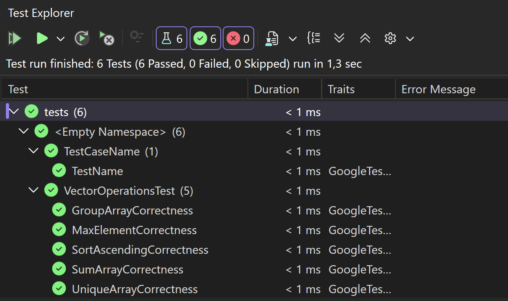
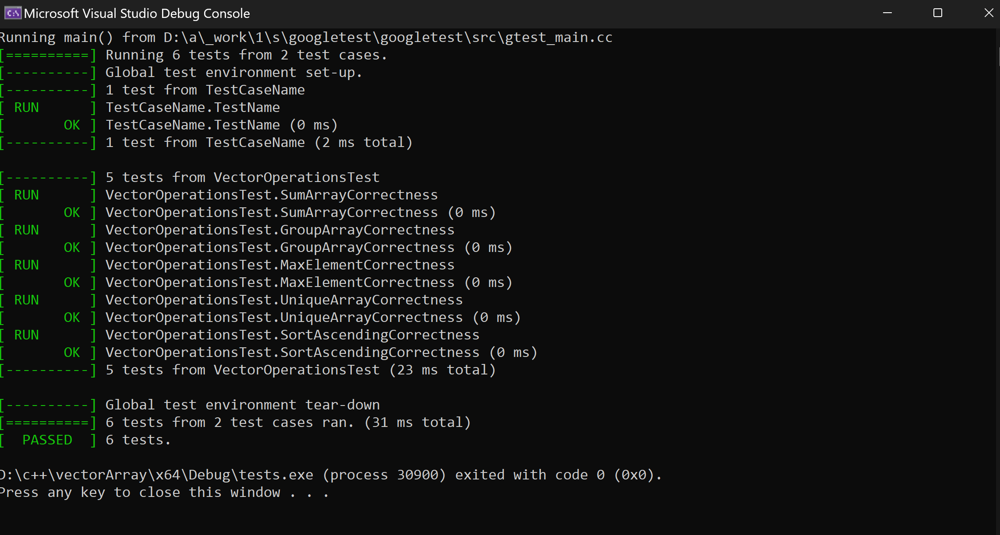

# 📊 Vector Operations Project

---

## 📌 Опис
Проєкт реалізує операції над масивами `vector<double>`:
- генерація
- групування
- сортування
- видалення дублікатів
- пошук максимуму

---

## 📂 Структура
src/ - основний код

tests/ - юніт-тести

data/ - txt і JSON  файли

json_developer/ - бібліотека JSON 

images/ - скріни

## 🖼️ Приклад роботи
## 🧪 Тести
✔ Google Test

## 👩‍💻 Автор
Андріана Філатова